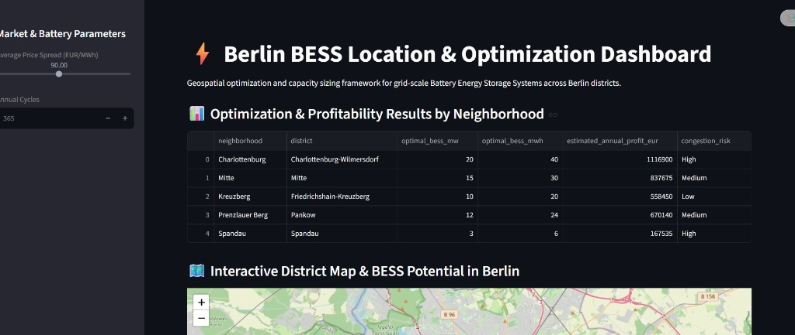
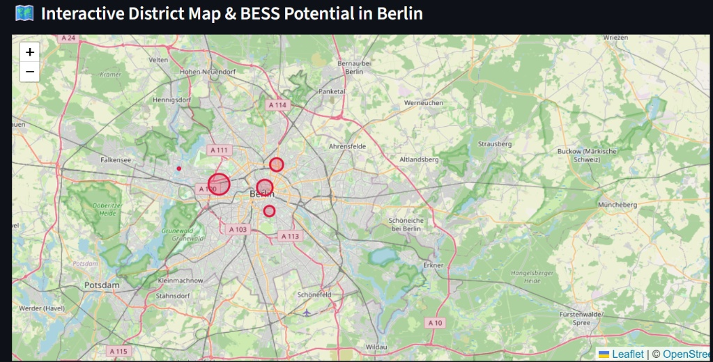

Markdown# Berlin BESS Siting & Optimization Dashboard

A geospatial optimization and capacity sizing framework for grid-scale Battery Energy Storage Systems (BESS) across Berlin districts. This project combines spatial data analysis, linear programming optimization, and an interactive web dashboard to evaluate grid congestion risks and maximize arbitrage profitability.

🌐 **Live Demo:** [View Streamlit Dashboard](https://scaling-zebra-wrvj49vjxwrq2gx77-8501.app.github.dev/)

---

## 🚀 Key Features

* **Geospatial District Analysis (`GeoPandas` & `Shapely`):** Models Berlin neighborhood boundaries, spatial distributions, and local grid congestion risks.
* **Linear Optimization Engine (`PuLP`):** Solves linear programming models to determine optimal power ($MW$) and energy ($MWh$) sizing for BESS units while maximizing annual arbitrage revenue.
* **Interactive Dashboard (`Streamlit` & `Folium`):** Provides a dynamic web interface featuring real-time parameter tuning (price spreads and annual cycles), optimization result tables, and an interactive map of Berlin.

---

## 📊 Dashboard Preview

| Optimization Results & Table | Interactive Folium Map |
| :---: | :---: |
|  |  |

---
## 📦 Tech Stack & Features Comparison

| Component | Technology | Primary Function |
| :--- | :--- | :--- |
| **GIS & Spatial** | GeoPandas, Shapely | Berlin district boundaries & spatial modeling |
| **Optimization** | PuLP (Linear Programming) | Siting, sizing ($MW/MWh$), & arbitrage maximization |
| **Dashboard** | Streamlit, Streamlit-Folium | Web UI, interactive maps, & parameter sliders |
| **Data Processing**| Pandas, NumPy | Market spread calculations & results aggregation |
---
## 📂 Project Structure

```text
berlin_bess_optimizer/
│
├── data/                    # Shapefiles and market data directory
├── gis/                     # Spatial data loading and processing modules
│   └── loader.py            # Generates Berlin district boundaries and grid parameters
├── optimization/            # Mathematical optimization modules
│   └── optimizer.py         # PuLP linear programming model for BESS sizing and profit
├── app.py                   # Main Streamlit dashboard application
└── requirements.txt         # Required Python packages
